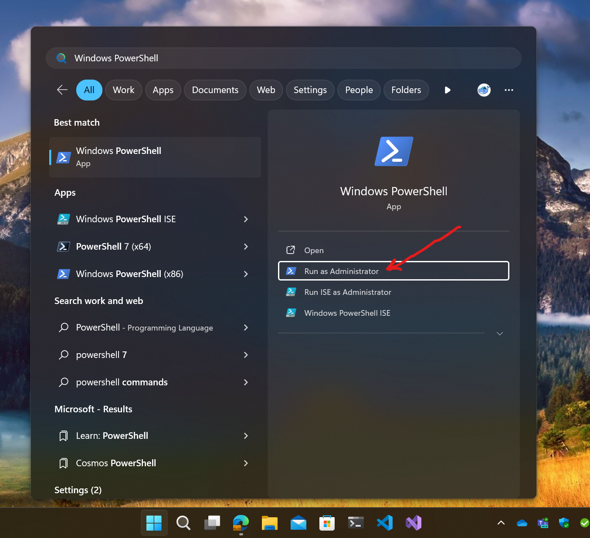
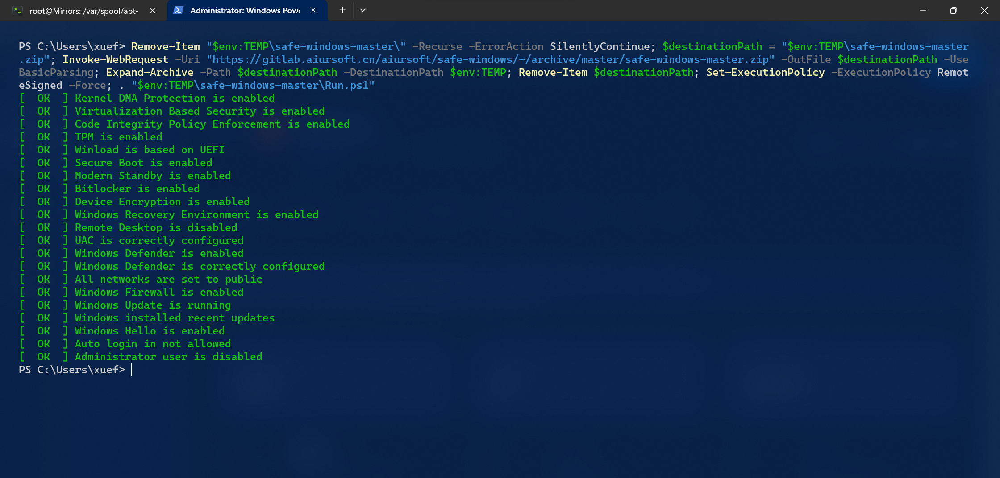

# Safe-Windows

[](https://gitlab.aiursoft.com/aiursoft/Safe-Windows/-/commits/master?ref_type=heads)

One-key PowerShell to check if your Windows is safe to use.

## How to run

First, search `PowerShell` in Windows search. Then click `Run as administrator`.



Then copy the following command and paste it into the PowerShell window. Then press `Enter`.

```powershell
Remove-Item "$env:TEMP\safe-windows-master\" -Recurse -ErrorAction SilentlyContinue; $destinationPath = "$env:TEMP\safe-windows-master.zip"; Invoke-WebRequest -Uri "https://gitlab.aiursoft.com/aiursoft/safe-windows/-/archive/master/safe-windows-master.zip" -OutFile $destinationPath -UseBasicParsing; Expand-Archive -Path $destinationPath -DestinationPath $env:TEMP; Remove-Item $destinationPath; Set-ExecutionPolicy -ExecutionPolicy RemoteSigned -Force; . "$env:TEMP\safe-windows-master\Run.ps1"
```

And then you will see the output like this:



It will show you suggestions to make your Windows safer.

## Is it safe\not safe based on this output?

This project is solely for checking if Windows complies with Microsoft's security best practices. If you do not trust Microsoft, then its theoretical security is not actual security. For example, it suggests that you use Microsoft's Secure Boot and code integrity checks. This means that your security is more easily controlled by Microsoft. Although Microsoft claims that they will focus on protecting user privacy and security, whether or not to trust Microsoft is still up to you.

If you see this project generate warnings for you, don't worry. These warnings often mean that your device may not comply with Microsoft's practices. If you can correctly assess the security risks these issues bring, for example, you are using your device in a trusted network and environment, then you can completely ignore these warnings.

Similarly, even if this project indicates that your device is very secure, you should not fully trust this project. Its output will not protect against the following:

* Being tracked by websites
* Downloading and running malicious software
* Hackers physically accessing the computer when there is no lock screen
* Inserting untrusted hardware devices

Therefore, real information security requires users to have a keen sense of problem detection and understanding of the principles, benefits, and costs of security. The warnings and information output by this project are only for quick identification by professionals.